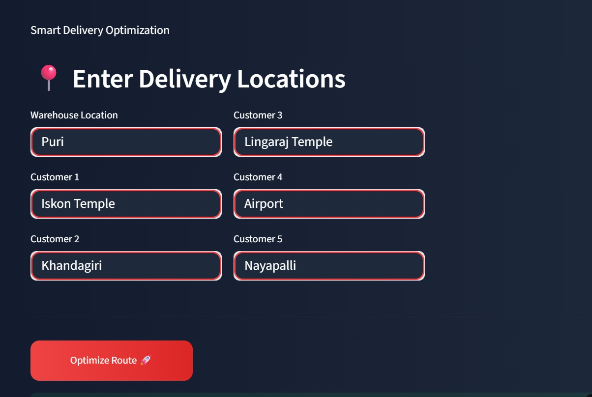
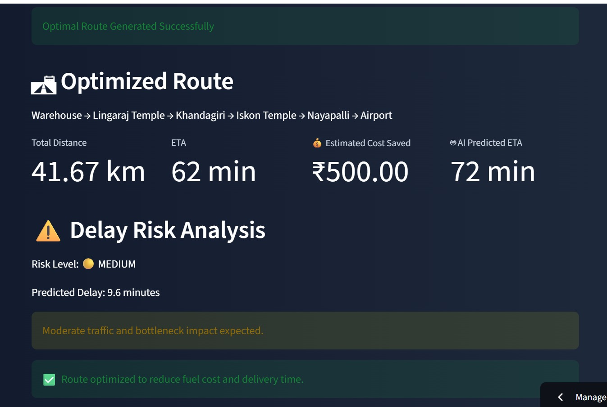
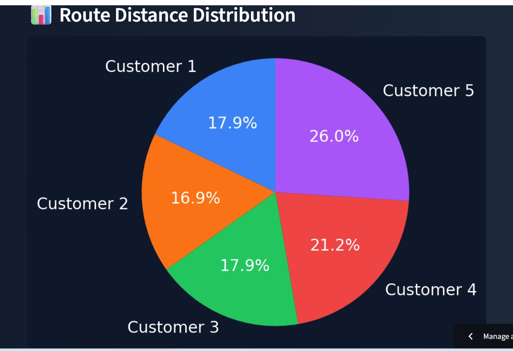
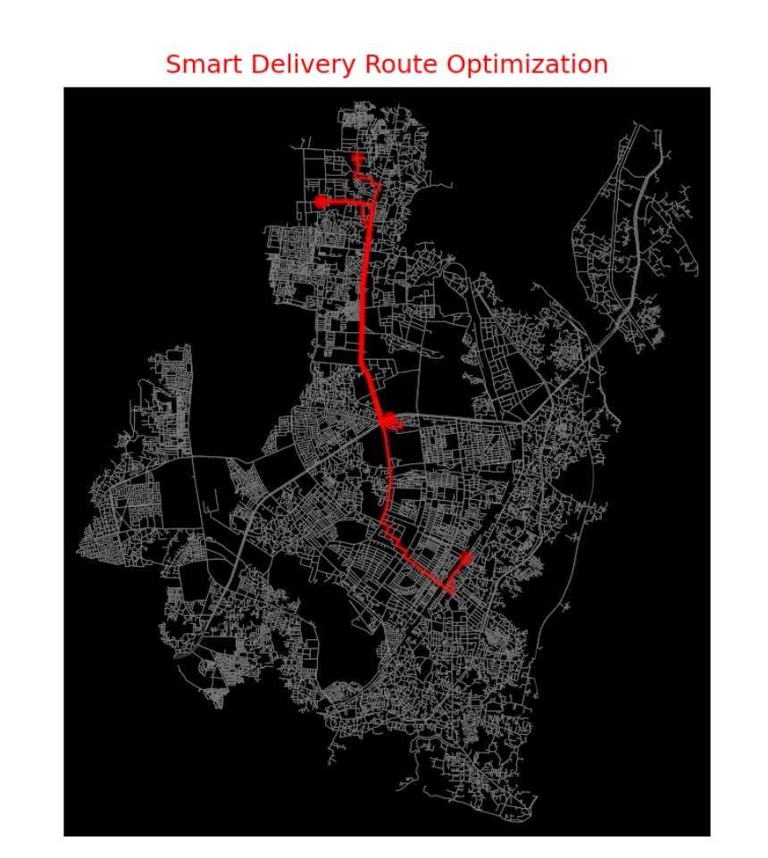

# Optimizing Delivery ETAs with Graph-Based Network Intelligence

## Project Overview

This project was developed as part of Summer Analytics 2026 organized by IIT Guwahati.

The objective is to improve delivery route efficiency and ETA prediction using graph-based network intelligence. The system models warehouses, hubs, and customer locations as a connected network and identifies optimal delivery routes while highlighting potential bottlenecks.

---

## Problem Statement

Traditional delivery planning often relies on shortest-path routing without considering network bottlenecks and delay risks.

This project aims to:

- Optimize delivery routes
- Estimate delivery time (ETA)
- Detect bottleneck locations
- Analyze route efficiency
- Provide operational insights through an interactive dashboard

---

## Features

- Route Optimization
- ETA Prediction
- Delay Risk Analysis
- Bottleneck Detection
- Route Distance Distribution
- Route Efficiency Analysis
- Interactive Streamlit Dashboard
- Route Visualization using OSMnx and NetworkX

---

## Technology Stack

- Python
- Streamlit
- NetworkX
- OSMnx
- Matplotlib
- Pandas
- NumPy

---

## Project Workflow

Warehouse & Customer Locations
    ↓
Road Network Extraction (OSMnx)
    ↓
Graph Construction (NetworkX)
    ↓
Route Optimization
    ↓
ETA Prediction
    ↓
Delay Risk Analysis
    ↓
Bottleneck Detection
    ↓
Interactive Dashboard

---

## Methodology

1. Build a graph-based logistics network.
2. Model warehouse and customer locations as nodes.
3. Calculate shortest routes using graph algorithms.
4. Estimate ETA using route distance and traffic factors.
5. Detect bottlenecks and delay-prone corridors.
6. Visualize insights through an interactive dashboard.

---

## Dashboard Modules

### Executive Summary
Overview of optimized routes and ETA predictions.

### Route Optimization
Finds the most efficient delivery path.

### ETA Prediction
Predicts delivery completion time.

### Delay Risk Analysis
Classifies routes into Low, Medium, or High delay risk.

### Bottleneck Analysis
Identifies critical nodes contributing to delays.

### Route Efficiency
Measures operational efficiency of optimized routes.

---

## Results

The system successfully:

- Reduces route distance
- Improves delivery planning
- Highlights bottlenecks
- Provides actionable operational insights
- Enhances ETA visibility

---

## Dashboard Preview

### Project Inputs


### Optimized Route


### Route Distance Distribution


### Bhubaneswar Route Map
 

---

## Future Scope

- Real-time traffic API integration
- Machine Learning based ETA prediction
- Multi-vehicle route optimization
- Live GPS tracking
- Dynamic route re-planning

---

## How to Run 

Clone the repository:

```bash
git clone https://github.com/Arkajyoti-Dutta/delivery-route-optimization.git
```

Install dependencies:

```bash
pip install -r requirements.txt
```

Run the Streamlit application:

```bash
streamlit run app.py
```

---

## Project Author

Arkajyoti Dutta , Ariv Bhattacharya , Aritra Saha

Summer Analytics 2026
IIT Guwahati
